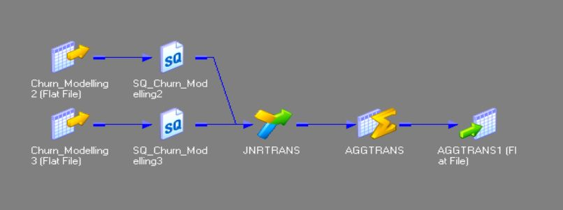
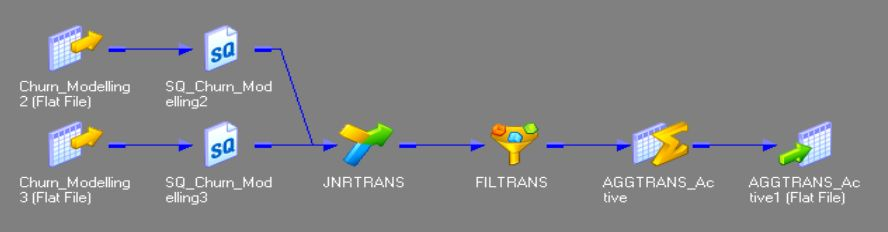
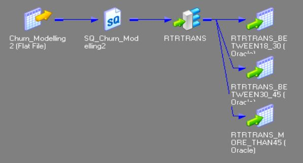
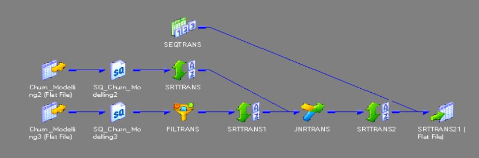
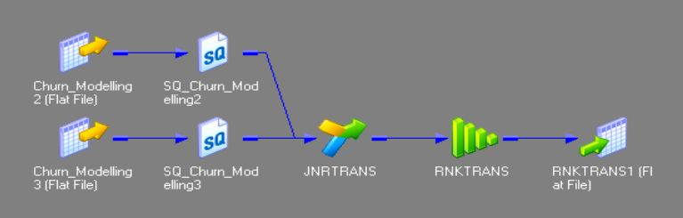
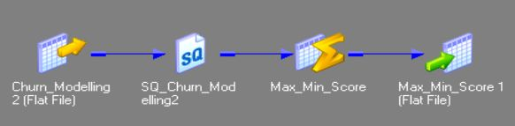

# Informatica Project

## Datasets
- Churn_Modelling2.csv
- Churn_Modelling3.csv

## Project Tasks
1. **Sum of Balances for Male and Female Customers**
   - Output:
   # 
   
2. **Number of Active Male and Female Customers**
   - Output:
   # 
   
3. **Customer Age Groups Distribution**
   - Groups:
     - Age between 18 – 30
     - Age between 30 - 45
     - Age > 45
   - Output:
   # 
   
4. **Users with Available Balance Data (balance > 0) Ranked Ascending**
   - Output:
   # 
   
6. **All Information for Customers with Top 5 Balances**
   - Output:
   # 
   
7. **Highest and Lowest Credit Score Values**
   - Output:
   # 
